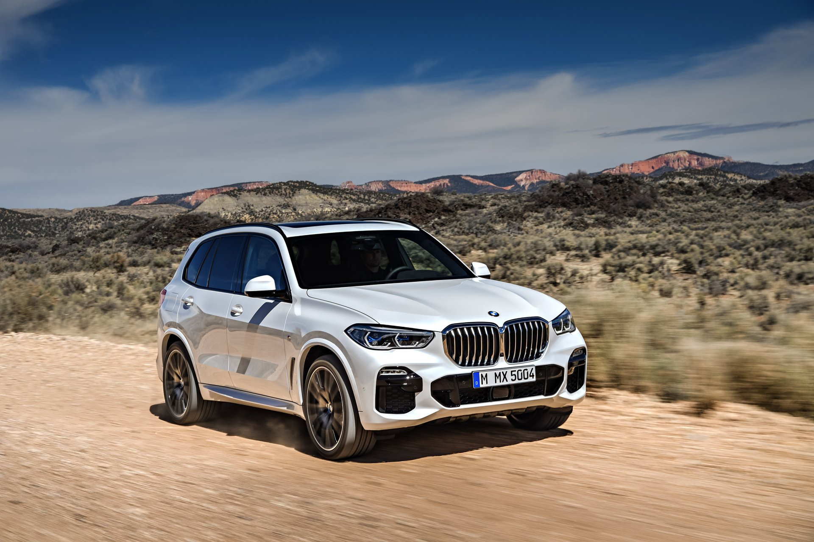
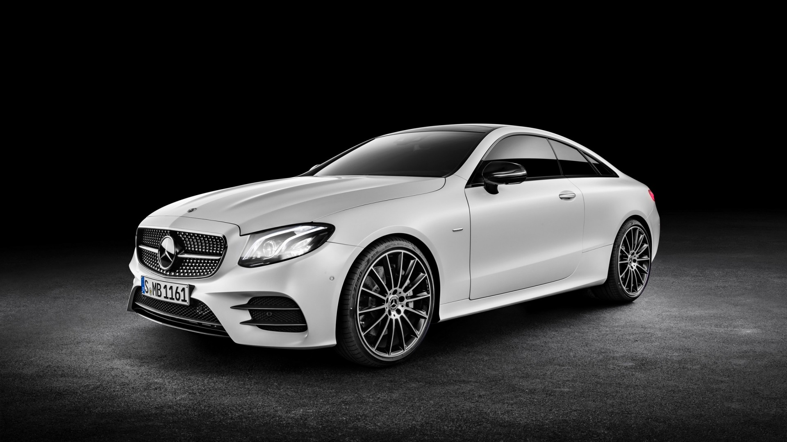

<!DOCTYPE html>
<html lang="en">
<head>
<meta charset="utf-8" />
<meta name="viewport" content="width=device-width,initial-scale=1" />
<title>DonEmilianoCARS — Certified Exclusivity</title>

<!-- Fonts -->
<link href="https://fonts.googleapis.com/css2?family=Playfair+Display:wght@400;700&family=Cinzel:wght@400;700&display=swap" rel="stylesheet">

</head>

<body>

  <!-- Masthead -->
  

    
Email: <strong>DonEmel@gmail.com</strong>

    
Follow Us:
      <a href="#">Instagram</a> |
      <a href="#">Facebook</a>
    

  

  <!-- Header -->
  <header class="sitehead">
    

      
      

        
DonEmilianoCARS

        
Certified Exclusivity

      

    

    

      <a href="#home">Home</a>
      <a href="#collection">Collection</a>
      <a href="#contact">Contact</a>
    

  </header>

  <!-- Hero -->
  <section class="hero" id="home">
    

      
      <h1 class="hero-title">DonEmilianoCARS</h1>
      
Certified Exclusivity

      

        <a href="#collection" class="btn">Browse Collection</a>
      

    

  </section>

  <!-- Welcome -->
  <section class="welcome">
    <h2>True Luxury is Flawless.</h2>
    
Welcome to DonEmilianoCARS — curators of certified, pre-owned luxury. Our vehicles embody exclusivity and precision craftsmanship for the discerning driver.

  </section>

  <!-- Featured -->
  <section class="featured">
    

      
      

        <h3>The Collection</h3>
        <a href="#collection" class="btn">Browse Now</a>
      

    

    

      
      

        <h3>The Guarantee</h3>
        <a href="#contact" class="btn">Our Promise</a>
      

    

  </section>

  <!-- Collection -->
  <section class="collection" id="collection">
    <h2 style="text-align:center;color:var(--gold);margin-bottom:20px;">Our Premium Collection</h2>
    

      

        
        

          <h4>BMW X5 (2022)</h4>
          
$65,000 • Black, White

        

      

      

        
        

          <h4>Mercedes E-Class (2021)</h4>
          
$55,000 • Silver, Black

        

      

      

        
        

          <h4>Tesla Model S (2023)</h4>
          
$90,000 • Red, Black

        

      

    

  </section>

  <!-- Footer -->
  <footer class="sitefoot">
    

      <h4>DonEmilianoCARS</h4>
      
Certified Exclusivity — Trusted Luxury

    

    

      <h4>Links</h4>
      <a href="#home">Home</a> 
      <a href="#collection">Collection</a> 
      <a href="#contact">Contact</a>
    

    

      <h4>Contact</h4>
      
Email: DonEmel@gmail.com

      
Phone: +63 912 345 6789

    

  </footer>

</body>
</html>
